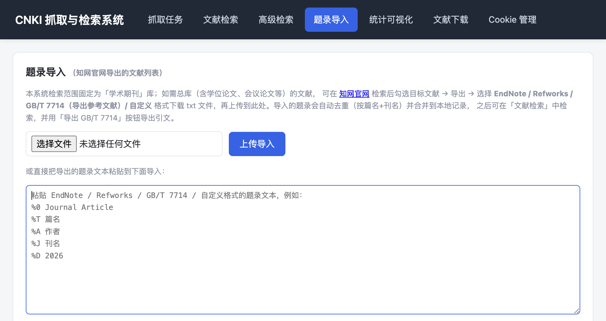

# CNKI 抓取与检索系统

基于 FastAPI 的中国知网（CNKI）文献抓取、检索与 PDF 全文下载的本地 Web 系统。提供可视化界面，支持按期刊批量抓取题录、高级检索、题录导入以及全文（CAJ 自动转 PDF）勾选下载，所有任务均通过 Server-Sent Events（SSE）实时推送日志。

## 系统总览

启动后访问 http://127.0.0.1:8000 即可打开 Web 控制台。顶部导航栏提供五个功能模块，覆盖从数据采集到全文下载的完整流程。


## 功能特性

### 1. 期刊抓取

按期刊列表批量抓取 CNKI 文献题录（篇名、作者、刊名、发表时间、关键词、摘要等），适合构建本地文献语料库。


**可配置参数：**
- **期刊列表**：每行一个期刊名，留空则使用内置的 23 个 CSSCI/核心期刊默认列表（含中国工业经济、管理世界、经济研究等）。
- **起始年 / 结束年**：抓取的年份区间，默认 2010–2019。
- **每页条数**：单次翻页请求的条数，默认 50。
- **最大页数**：限制每个期刊最多抓取多少页，0 表示不限。
- **最小/最大间隔（秒）**：每次请求的随机睡眠区间，规避反爬。
- **清空已有进度**：勾选后会重置断点状态，重新从第一页开始抓取。

**运行时展示：** 启动后右侧实时日志区通过 SSE 滚动输出抓取进度；左侧状态卡片显示当前期刊、页码进度、本任务已写记录数、已耗时与错误信息。支持断点续抓——中断后再次启动会从上次记录的期刊与页码继续。

### 2. 文献检索（含 PDF 下载）

对本地题录（抓取 + 导入）进行多维分页检索，并支持勾选下载 PDF 全文。


**检索条件：** 关键词（在篇名/作者/摘要/关键词中匹配）、期刊、作者、年份，可任意组合。支持每页 10/20/50/100 条切换。

**结果展示：** 知网风格表格，列为 **复选框 / 题名 / 作者 / 来源（刊名）/ 发表时间 / 数据库（学术期刊、报纸、学位论文、会议等）/ 操作**；**点击任意行可展开**查看检索期刊、关键词、摘要全文与原文链接。

**操作列：**
- **下载PDF**：单条下载该文献全文；
- **复制引文**：一键复制该条记录的 GB/T 7714 格式引文（如 `作者. 篇名[J]. 刊名,2026.`），可直接粘贴到论文参考文献。

**PDF 下载（单条与批量）：**
- 每行「操作」列提供 **下载PDF** 按钮，可单条下载；
- 行首复选框可勾选（跨页保留），工具栏 **下载选中 (N)** 按钮批量下载，支持表头全选本页；
- 下载策略：优先使用 grid 列表中的下载链接（不触发验证码），CAJ 文件自动转换为标准 PDF（KDH 解密），无下载链接的老记录按篇名回查补全；
- 页面下方「下载任务」卡片实时显示进度（已下载/跳过/失败/当前标题）与 SSE 日志，「已下载 PDF 文件」列表展示文件名、大小、时间，并提供下载链接。

### 3. 高级检索（CNKI 实时）

与 CNKI `kns8s/AdvSearch` 接口一致的实时高级检索，不依赖本地数据，直接查询知网。


**检索能力：**
- **多条件组合**：可添加任意数量的检索条件行，行间用 AND / OR / NOT 逻辑连接（首行逻辑固定为 AND）。
- **检索字段**：主题、篇名、关键词、作者、作者单位、来源期刊、摘要、基金、中图分类号、DOI、参考文献。
- **来源类别筛选**：CSSCI、北大核心、SCI/EI/SSCI/AHCI、CSCD、CSTPCD，可多选。
- **年代范围**：自定义起止年。

**两种使用方式：**
- **检索**：单页实时查询，结果表格显示篇名（带原文链接）、作者、刊名、发表时间，支持翻页。
- **采到本地**：启动后台采集任务，按当前条件分页抓取全部结果并合并写入本地 records，可设置最大页数与抓取间隔，下方实时显示采集进度与日志。

> 注：CNKI 翻页必须携带前一页返回的 turnpage 令牌，系统按查询签名缓存会话链以支持任意页跳转；上传新 Cookie 后缓存自动失效。

### 4. 题录导入

本系统检索范围固定为「学术期刊」库；如需知网官网总库（含学位论文、会议论文等）的文献，可在官网检索后导出题录，上传到本系统合并入库。



**使用步骤：**
1. 在知网官网检索，勾选目标文献，点击「导出」；
2. 选择 **EndNote / Refworks / GB/T 7714（导出参考文献）/ 自定义** 任一格式，下载 txt 文件（支持 UTF-8 与 GBK 编码）；
3. 在本页签**上传该文件**导入，或把导出内容**直接粘贴**到文本框导入。

**导入行为：** 自动识别四种导出格式并解析（篇名、作者、刊名、发表时间、关键词、摘要、链接；GB/T 7714 格式额外识别文献类型 [J]/[N]/[D]/[C]）；按「篇名+刊名」与本地已有记录去重；导入后自动重建全量 JSON，立即可在「文献检索」中检索与下载。

**导出引文：** 「文献检索」页工具栏提供 **导出 GB/T 7714** 按钮，按当前检索条件（关键词/期刊/作者/年份）将本地记录导出为 GB/T 7714 格式的引文 txt 文件（如 `[1]作者. 篇名[J]. 刊名,2026.`），可直接用于论文参考文献列表。

### 5. Cookie 管理

CNKI 抓取与下载均需登录态，本模块统一管理 Cookie。


**功能：**
- **上传文件**：上传浏览器导出的 `cnki_cookies.json`；
- **直接粘贴**：把 Cookie JSON 文本粘贴到文本框保存，无需先存文件；
- **状态查看**：是否已上传、条目数、所属域名；
- **删除 Cookie**。

保存/上传后会自动使检索会话缓存失效，确保使用新会话。

## 技术栈

| 层 | 技术 |
| ---- | ---- |
| 后端 | FastAPI + Uvicorn |
| HTTP/解析 | requests + BeautifulSoup4 |
| PDF 处理 | PyPDF2 |
| 前端 | 原生 HTML / CSS / JavaScript（无构建步骤） |
| 实时日志 | Server-Sent Events（SSE） |
| 数据存储 | JSON / NDJSON（文件存储，无需数据库） |

## 项目结构

```
zhiwang/
├── backend/                 # FastAPI 后端
│   ├── main.py              # 应用入口与全部 API 路由
│   ├── scraper.py           # 按期刊抓取、高级检索采集与 turnpage 会话管理
│   ├── pdf_downloader.py    # PDF/CAJ 全文下载
│   ├── importer.py          # 官网导出题录（EndNote/Refworks/自定义）解析与导入
│   └── storage.py           # JSON/NDJSON 存储与检索、Cookie 管理
├── static/                  # 前端静态资源
│   ├── index.html           # 单页控制台
│   ├── app.js               # 各 Tab 渲染与事件逻辑
│   └── style.css            # 样式
├── docs/                    # 文档与截图
│   ├── screenshot.png
│   ├── scrape.png
│   ├── records.png
│   ├── advsearch.png
│   ├── import.png
│   └── cookie.png
├── requirements.txt
├── start.sh                 # 后台启动脚本
├── stop.sh                  # 停止脚本
└── .gitignore
```

## 安装与运行

### 1. 安装依赖

```bash
pip install -r requirements.txt
```

依赖清单：`fastapi`、`uvicorn[standard]`、`requests`、`beautifulsoup4`、`python-multipart`、`PyPDF2`。

### 2. 准备 Cookie

从浏览器导出 CNKI 登录后的 Cookie 为 `cnki_cookies.json`（放在项目根目录），或启动后通过界面「Cookie 管理」标签页上传。抓取与下载均依赖有效 Cookie。

### 3. 启动服务

后台启动（推荐）：

```bash
./start.sh
```

前台运行（便于调试）：

```bash
python -m uvicorn backend.main:app --host 0.0.0.0 --port 8000
```

启动成功后访问：http://127.0.0.1:8000

### 4. 停止服务

```bash
./stop.sh
```

## 主要 API

| 方法 | 路径 | 说明 |
| ---- | ---- | ---- |
| GET | `/api/health` | 健康检查 |
| GET | `/api/journals` | 默认与已抓取期刊列表 |
| GET | `/api/records` | 本地记录分页检索 |
| GET | `/api/records/stats` | 本地记录聚合统计 |
| GET | `/api/records/export` | 按检索条件导出本地记录为 GB/T 7714 引文文本 |
| POST | `/api/records/import` | 上传导入官网导出的题录文件（EndNote/Refworks/GB-T-7714/自定义） |
| POST | `/api/records/import_text` | 直接粘贴题录文本导入 |
| GET | `/api/search/fields` | 检索字段与来源类别元数据 |
| POST | `/api/search` | 单页实时高级检索 |
| POST | `/api/search/collect` | 启动后台采集任务 |
| GET | `/api/search/collect/status` | 采集任务状态 |
| GET | `/api/search/collect/logs` | 采集实时日志（SSE） |
| POST | `/api/scrape/start` | 启动按期刊抓取 |
| POST | `/api/scrape/stop` | 停止抓取 |
| GET | `/api/scrape/status` | 抓取任务状态 |
| GET | `/api/scrape/logs` | 抓取实时日志（SSE） |
| POST | `/api/pdf/start` | 启动全文下载（支持按记录索引勾选下载） |
| POST | `/api/pdf/stop` | 停止下载 |
| GET | `/api/pdf/status` | 下载任务状态 |
| GET | `/api/pdf/files` | 已下载文件列表（仅 PDF） |
| GET | `/api/pdf/files/{name}` | 下载指定文件 |
| GET / POST / DELETE | `/api/cookie` | Cookie 查询 / 上传 / 删除 |
| POST | `/api/cookie/text` | 直接粘贴 Cookie JSON 文本保存 |

## 数据存储

所有抓取产物默认写入项目根目录下的 `cnki_2010_2019/`（路径可在 `backend/storage.py` 调整）：

| 文件 | 说明 |
| ---- | ---- |
| `cnki_records.ndjson` | 题录主数据（每行一条 JSON，增量写入，断点续抓友好） |
| `cnki_records.json` | 题录全量 JSON（供前端浏览/统计） |
| `cnki_scrape_state.json` | 抓取进度状态（期刊/页码断点） |
| `cnki_scrape_summary.json` | 抓取汇总 |
| `pdfs/` | 下载的全文文件（CAJ/PDF） |

## 注意事项

- **检索范围说明**：本系统的高级检索固定检索 CNKI「学术期刊」子库（`Resource: JOURNAL`）。知网官网默认检索范围是「总库」（含学位论文、会议论文、报纸等），因此**同一检索词下系统返回的条数会少于官网总库**，官网结果中混有的硕博/会议文献在系统里查不到，属正常差异而非数据缺失。对比时请以官网限定「学术期刊」范围的结果为基准。此外系统走 sclib.cn 代理镜像，数据可能比官网略有滞后。如需总库文献，请使用「题录导入」功能导入官网导出的题录。
- **排序说明**：系统检索结果固定按发表时间降序排列；知网官网默认按相关度排序，两边前几页的顺序会不同。
- 抓取与下载行为需遵守 CNKI 的使用条款，请合理控制请求频率（系统默认已内置随机间隔）。
- `cnki_cookies.json` 含登录凭证，已加入 `.gitignore`，切勿提交到版本库。
- CNKI 翻页依赖前一页返回的 turnpage 令牌，高级检索按查询签名缓存会话以支持任意页跳转。
- 当 CNKI 触发安全验证时，系统会抛出 `BlockedError`，前端提示重新上传 Cookie。
