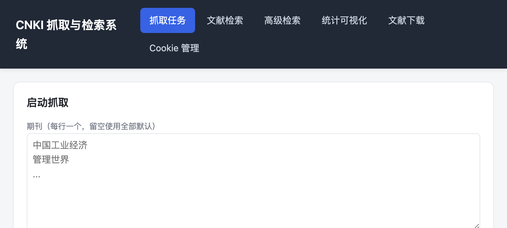

# CNKI 抓取与检索系统

基于 FastAPI 的中国知网（CNKI）文献抓取、检索、统计与 PDF 全文下载的本地 Web 系统。提供可视化界面，支持按期刊批量抓取题录、高级检索、数据统计可视化以及全文（CAJ/PDF）批量下载。



## 功能特性

系统共分为六个功能模块：

- **抓取任务**：按期刊列表批量抓取 CNKI 文献题录（篇名、作者、刊名、发表时间、关键词等），支持起止年份、每页条数、最大页数、抓取间隔与断点续抓。
- **文献检索**：对已抓取到本地的记录按关键词、期刊、作者、年份进行分页检索。
- **高级检索**：与 CNKI `kns8s/AdvSearch` 接口一致的实时高级检索，支持多条件组合（AND/OR/NOT）、来源类别筛选、年代范围；可单页实时查询，也可启动后台采集任务把结果合并到本地。
- **统计可视化**：按期刊、年份、高产作者、高频关键词对已抓取记录进行聚合统计并以条形图展示。
- **文献下载**：在已抓取记录中按筛选条件批量下载全文，优先使用 grid 下载链接（CAJ），无链接时回退详情页；支持覆盖已存在、下载间隔控制与失败列表。
- **Cookie 管理**：上传/删除 CNKI 登录 Cookie（`cnki_cookies.json`），抓取与下载共用同一 Cookie 会话。

## 技术栈

- **后端**：FastAPI + Uvicorn
- **HTTP/解析**：requests + BeautifulSoup4
- **PDF 处理**：PyPDF2
- **前端**：原生 HTML/CSS/JavaScript（无构建步骤）
- **实时日志**：Server-Sent Events（SSE）

## 项目结构

```
zhiwang/
├── backend/                 # FastAPI 后端
│   ├── main.py              # 应用入口与全部 API 路由
│   ├── scraper.py           # 按期刊抓取与高级检索采集
│   ├── pdf_downloader.py    # PDF/CAJ 全文下载
│   └── storage.py           # JSON/NDJSON 存储与检索
├── static/                  # 前端静态资源
│   ├── index.html
│   ├── app.js
│   └── style.css
├── docs/
│   └── screenshot.png        # 界面截图
├── requirements.txt
├── start.sh                 # 后台启动脚本
└── stop.sh                  # 停止脚本
```

## 安装与运行

### 1. 安装依赖

```bash
pip install -r requirements.txt
```

### 2. 准备 Cookie

从浏览器导出 CNKI 登录后的 Cookie 为 `cnki_cookies.json`（放在项目根目录），或启动后通过界面的「Cookie 管理」标签页上传。抓取与下载都需要有效 Cookie。

### 3. 启动服务

```bash
./start.sh
```

或前台运行（便于调试）：

```bash
python -m uvicorn backend.main:app --host 0.0.0.0 --port 8000
```

启动成功后访问：http://127.0.0.1:8000

### 4. 停止服务

```bash
./stop.sh
```

## 主要 API

| 方法 | 路径 | 说明 |
| ---- | ---- | ---- |
| GET | `/api/health` | 健康检查 |
| GET | `/api/journals` | 默认与已抓取期刊列表 |
| GET | `/api/records` | 本地记录分页检索 |
| GET | `/api/records/stats` | 本地记录聚合统计 |
| GET | `/api/search/fields` | 检索字段与来源类别元数据 |
| POST | `/api/search` | 单页实时高级检索 |
| POST | `/api/search/collect` | 启动后台采集任务 |
| GET | `/api/search/collect/status` | 采集任务状态 |
| GET | `/api/scrape/start` | 启动按期刊抓取 |
| GET | `/api/scrape/status` | 抓取任务状态 |
| GET | `/api/scrape/logs` | 抓取实时日志（SSE） |
| POST | `/api/pdf/start` | 启动全文下载 |
| GET | `/api/pdf/status` | 下载任务状态 |
| GET | `/api/pdf/files` | 已下载文件列表 |
| GET/POST/DELETE | `/api/cookie` | Cookie 查询/上传/删除 |

## 数据存储

所有抓取产物默认写入项目根目录下的 `cnki_2010_2019/`（可通过 `backend/storage.py` 调整）：

- `cnki_records.ndjson` / `cnki_records.json`：题录数据
- `cnki_scrape_state.json`：抓取进度状态（用于断点续抓）
- `cnki_scrape_summary.json`：抓取汇总
- `pdfs/`：下载的全文文件

## 注意事项

- 抓取与下载行为需遵守 CNKI 的使用条款，请合理控制请求频率（默认已内置随机间隔）。
- `cnki_cookies.json` 含登录凭证，已加入 `.gitignore`，切勿提交到版本库。
- CNKI 翻页依赖前一页返回的 turnpage 令牌，高级检索按查询签名缓存会话以支持任意页跳转。
